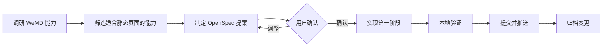

# WeMD 图文编辑器优化计划

## 目标
基于 tenngoxars/WeMD 的长处，优先优化本项目的公众号编辑器（views/md.html）。目标是提升 Markdown 到公众号 HTML 的解析、预览、复制兼容与本地保存能力，避免引入大型构建体系或服务端依赖。

## 流程图

## 候选能力
1. Markdown 解析增强：GFM 表格、任务列表、提醒块、上下标、标记文本、脚注链接、图片滑动组。
2. 微信复制兼容链路：根容器 padding 下沉、背景色下沉、文本颜色实体化、表格布局强化。
3. 表格体验优化：宽表格横向滑动、紧凑字号、居中单元格、复制前保留移动端可读性。
4. 图片工作流：本地图片压缩、图片引用、后续可扩展图床配置。
5. 本地历史记录：沿用当前静态站点的 localStorage 保存最近版本，支持恢复；后续如历史量变大再迁移 IndexedDB。
6. 深色模式预览：作为后续阶段，不优先进入第一轮。

## 第一阶段建议
先做不需要服务端的增强：
1. md 页 Markdown 渲染支持任务列表、提醒块、图片滑动组语法。
2. 一键复制到公众号前增加 WeMD 风格的 DOM 归一化：padding 下沉、背景色下沉、文本颜色实体化、表格布局强化。
3. md 页预览与复制结果里的宽表格横向滚动兼容。
4. 本地历史快照，保留最近 30 条，支持恢复。

## 暂缓项
1. 多图床上传：需要配置密钥和服务端能力，不适合直接放入静态站点第一轮。
2. Mermaid 图表：可做，但需要额外渲染和导出稳定性验证。
3. 深色模式预览：价值高，但代码量较大，建议第二阶段单独做。
